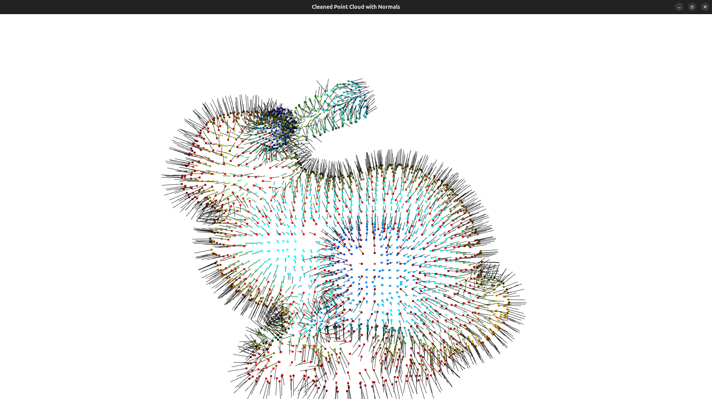
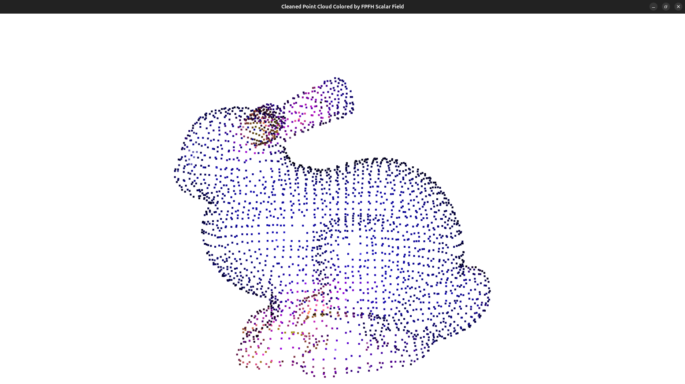
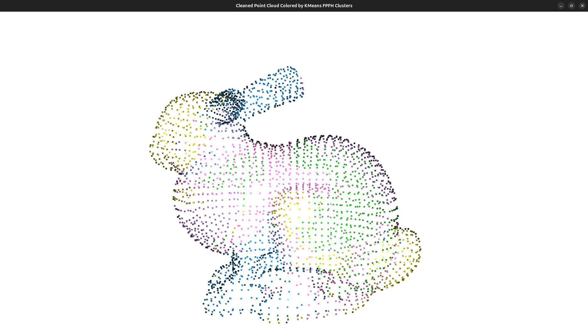

# Point Cloud Feature Analysis

Preprocessing and FPFH feature analysis pipeline on the Stanford Bunny dataset, built with Python and Open3D.

## What it does

Runs a 6-stage preprocessing pipeline on the Stanford Bunny `.ply` file, then performs two types of geometric feature analysis using FPFH (Fast Point Feature Histograms).

**Preprocessing pipeline:**

| Stage | Output |
|---|---|
| Load | 35,947 points from raw scan |
| Voxel downsampling | 3,023 points |
| Statistical outlier removal | 2,879 points |
| Normal estimation | Normals computed via KDTree |
| FPFH extraction | (33, 2879) feature matrix |
| Visualization | Point cloud + normals |

**Feature analysis:**
- **Per-point feature coloring** — maps a single FPFH bin across all points to a plasma colormap, revealing which surface regions share geometric character
- **Geometric clustering** — K-means (k=5) on the full 33-dimensional FPFH vectors groups points by local geometry, independent of spatial position

## What is FPFH?

FPFH (Fast Point Feature Histograms) describes the local geometry around each point as a 33-bin histogram. It captures how surface normals vary across a point's neighborhood — flat regions, edges, and corners each produce a distinct histogram shape. Points with similar FPFH vectors have similar local geometry regardless of where they are on the surface.

## Results

**Normals**



**Feature coloring** — surface colored by FPFH bin 22 values



**Geometric clustering** — 5 clusters by FPFH similarity



## Setup

```bash
git clone <repo>
cd pointcloud_feature_analysis
python3 -m venv venv
source venv/bin/activate
pip install -r requirements.txt
```

Download the Stanford Bunny from [graphics.stanford.edu/data/3Dscanrep](https://graphics.stanford.edu/data/3Dscanrep/) and place `bun_zipper.ply` at:

```
data/bunny/reconstruction/bun_zipper.ply
```

## Run

```bash
XDG_SESSION_TYPE=x11 python3 src/pipeline.py
```

> `XDG_SESSION_TYPE=x11` is required on Ubuntu 24.04 with Wayland — Open3D's visualizer needs an X11 context.

## Stack

- Python 3
- [Open3D](http://www.open3d.org/) 0.19.0
- NumPy 2.4.4
- scikit-learn
